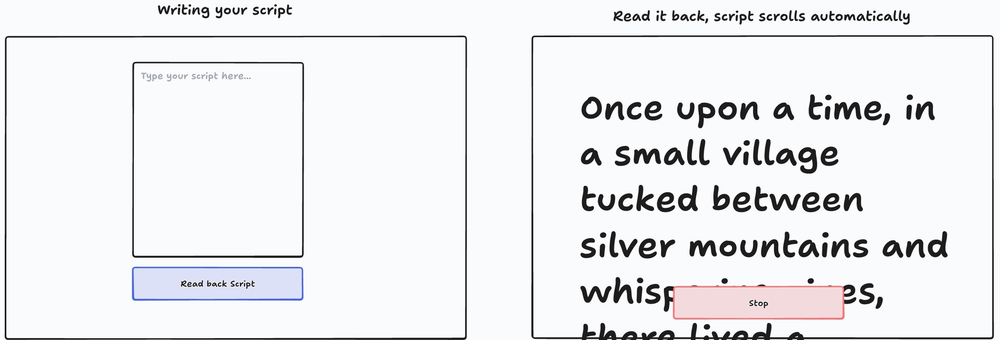

# AI Teleprompter

A fast, speech-synced teleprompter for reading scripts out loud. Paste your script, start a read-back session, and the prompter keeps the next lines in view while tracking what you’re saying (including light paraphrasing and short tangents).



## Features

- **Speech-synced scrolling**: highlights the next word and scrolls as you speak.
- **Readable prompter layout**: large text, limited lines, minimal eye travel.
- **Session controls**: start read-back, end session, and switch reading theme.

## Quick Start

### 1) Try it on GitHub Pages

You can use the hosted build on **[GitHub Pages](https://soniyagaikwad.github.io/ai-teleprompter/)**!

### 2) Run locally

Speech recognition typically requires the page to be served over `http://localhost` (opening `index.html` via `file://` often blocks mic/speech APIs).

From the repo root:

```bash
python3 -m http.server 8000
```

Then open `http://localhost:8000` in your browser.

### 3) Use the App

- **Paste or write** your script in the “Your script” box.
- Click **Read back script**.
- When prompted, **allow microphone access**.
- Start reading — the prompter will follow along and scroll to keep upcoming text visible.

## Browser Support

- **Recommended**: latest Chrome or Edge (desktop).
- If you see “Speech recognition is not available in this browser”, switch to Chrome/Edge.

## Tips for Best Results

- **Use a decent mic** and a quiet room for fewer recognition errors.
- **Add punctuation** to your script — it improves pacing and matching.
- If you tend to ad-lib, **keep tangents short**; the prompter will generally recover when you return to the script.

## Troubleshooting

- **Mic permission denied**: check your browser site settings for `http://localhost:8000` and allow Microphone.
- **Nothing happens when starting**: confirm you’re not using a `file://` URL; run a local server as above.
- **Recognition stops mid-session**: some browsers pause recognition after silence — try speaking a bit louder/closer to the mic, or restart the session.

## Project Layout

- `index.html`: app shell + UI structure
- `styles.css`: styling for editor + reading mode
- `app.js`: app logic (speech recognition + scrolling/highlighting)

## Technical Decisions

- **On-device speech (Web Speech API) instead of hosted automatic speech recognition (ASR) or an LLM** — each browser supplies its own speech-to-text (no separate AI service, no API keys, no uploading your voice to a server). That keeps the loop simple and fast. It works best in **Chrome or Edge on a desktop** due to its ASR capabilities, but it also works well on different browsers like Safari.

- **Robust alignment between live transcript and script (non-verbatim read-through)** — in practice, nobody reads every word exactly as written. They paraphrase, skip a word, or toss in a short aside. So instead of hunting for a perfect string match, the app repeatedly asks: *given the latest chunk of transcript, where in the script does that best line up?* It gently penalizes wandering off-script vs skipping ahead in the document, so a brief tangent doesn’t permanently confuse the highlight—and when you return to the script, the prompter can find you again.

- **Token normalization and fuzzy matching tolerant of ASR errors, plus cursor tie-breaking** — dictation mangles names and long words; speakers say “don’t” vs “do not.” Text is normalized in a straightforward way (case, accents, punctuation) and **near-misses** on spelling are allowed, especially on longer tokens. The **last stable alignment position** breaks ties when two parts of the script could both fit, so the cursor doesn’t jitter back and forth.

- **Interim speech results and a continuous capture / restart loop for low-latency UI** — the microphone session stays alive, and **partial** phrases update the UI as you go. That’s what makes the scroll feel tied to your mouth instead of waiting until you finish a whole sentence.

- **Line-count / words-per-line constraints with measured horizontal scaling on resize** — the spec called for only a few words per line and only a few lines on screen at once, with breaks after sentences when possible—less eye travel, easier reading. On a laptop that felt great. On a **large or external monitor**, the same rules made the font so tall that a full line of five words could run off the **sides** of the box. **Overflow was addressed by measuring the longest line after layout** (and again when the window is resized) and **slightly shrinking the type** only when needed, so lines stay visible everywhere without giving up the “large, comfortable” goal.

## Potential Enhancements

- **Upload text documents and extract a script** — supporting `.txt`, `.docx`, or PDF would let people pull a talk straight from notes or a draft without copy-paste friction. The interesting work is layout-aware extraction (headings, slide notes vs body) and a clear preview so users can edit before read-back.
- **Upload a slide deck and generate a script from the presentation** — slide titles, bullet fragments, and speaker notes are rarely ready to read verbatim; a pipeline could turn them into full sentences with connected thoughts, then feed the same teleprompter UI. That implies owning file parse (e.g. PPTX), optional LLM pass for generation, and guardrails so the on-screen script stays faithful to what the author approved.
- **Live speaking-rate estimates and pacing feedback** — use the transcript stream (and timestamps if available) to approximate WPM or syllable rate, compare to a target range or rehearsal baseline, then surface gentle nudges (“a little slower”, “you’re ahead of this section”) without fighting the existing alignment logic.

## Specs

The original product spec is preserved in `ai-teleprompter-specs.md`.